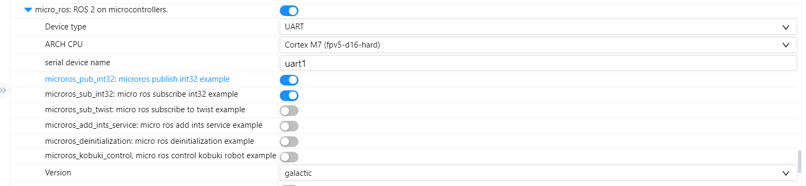

# week 2

> 2022/07/04 - 2022/07/10

## 上周问题

* 单片机和ROS2 无法连接

**上周会议给出的原因和建议：**

* 原因
  * 使用虚拟机，导致数据多次转发，可能存在数据延迟问题；
  * docker版本过旧；
* 建议：
  * 使用WSL或者双系统；
  * 安装新版本的docker；
  * 使用串口作为测试；

## 本周工作

1. 在window上基于RT-Thread Studio和art-pi构建micro ros (串口)工程；
2. 在Ubuntu上构建`micro-ros-agent` ( docker & Vulcanexus)

###  docker

版本：20.10.17

```bash
# 运行micro-ros-agent：本地
docker run -it --net=host microros/micro-ros-agent:galactic udp4 -p 8888
# 运行micro-ros-demos
sudo docker run -it --net=host microros/micro-ros-demos bash
source install/local_setup.bash
ros2 run micro_ros_demos_rclc int32_publisher
# 查看话题
ros2 topic list
ros2 topic echo /std_msgs_msg_Int32
```

可以看到话题，说明micro-ros-agent没有问题

```bash
# 运行micro-ros-agent
docker run -it -v /dev:/dev --privileged microros/micro-ros-agent:galactic serial --dev /dev/ttyUSB0
# docker run -it -p 9999:9999/udp --privileged microros/micro-ros-agent:galactic udp4 -p 9999

# 单片机
microros_pub_int32
```


结果：

```bash
# ubuntu
[1657365773.777815] info     | TermiosAgentLinux.cpp | init                     | running...             | fd: 3
[1657365773.778163] info     | Root.cpp           | set_verbose_level        | logger setup           | verbose_level: 4
[1657365857.374839] info     | Root.cpp           | create_client            | create                 | client_key: 0x10176887, session_id: 0x81
[1657365857.375037] info     | SessionManager.hpp | establish_session        | session established    | client_key: 0x10176887, address: 0
[1657365858.394287] info     | ProxyClient.cpp    | create_participant       | participant created    | client_key: 0x10176887, participant_id: 0x000(1)

# 单片机
[micro_ros] node created                                                        
[micro_ros] publisher created                                                   
[micro_ros] timer created                                                       
[micro_ros] executor created                                                    
[micro_ros] New thread mr_pubint32 
```


micro_ros 软件包配置



### Vulcanexus

[Vulcanexus](https://docs.vulcanexus.org/en/galactic/rst/installation/linux_binary_installation.html)

```bash
# agent 测试
ros2 run micro_ros_agent micro_ros_agent udp4 -p 8888
# demos 测试
sudo docker run -it --net=host microros/micro-ros-demos bash
source install/local_setup.bash
ros2 run micro_ros_demos_rclc int32_publisher
```

可以看到话题，说明基于Vulcanexus安装的micro-ros-agent没有问题

```bash
# 运行micro-ros-agent
ros2 run micro_ros_agent micro_ros_agent serial -D /dev/ttyUSB0
# 单片机
microros_pub_int32
```

结果和 docker一致。

## 结果 & 问题

结果：单片机和ROS2 无法连接的问题没有解决。从结果上来看，还是create_topic没有成功。

目前micro ros agent运行在双系统的Ubuntu上，应该不存在数据多次转化。目前猜想是不是单片机端配置有问题。


