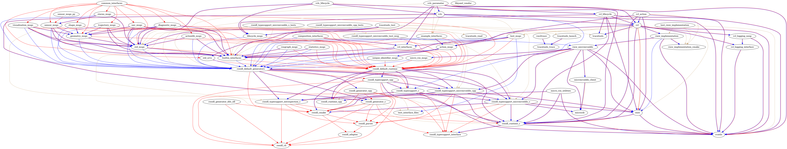

# week6

> 2022/08/08 - 2022/08/012

## 上周任务

* 尝试寻找分离rclc rmw的方法；

## 完成情况

micro ros 构建复杂，一共有25个文件，64个包，编译出108个静态文件，因此文件和文件之间存在一定的依赖关系，在编译过程中ament贯穿整个编译过程，其作用大致如下：

* 调用cmake编译c文件；
* 将..msg  .srv等ROS消息类型转换为c文件；

因此micro ros 以rclc 和Micro-XRCE-DDS为基础，以ROS消息类型，适配和转化rclc、Micro-XRCE-DDS支撑文件为辅助；**所以分离难度较大**；

目前尝试过脱离ament，直接使用cmake进行交叉编译，以Micro-CDR、Micro-XRCE-DDS-Client进行尝试（Micro-CDR无依赖；Micro-XRCE-DDS-Clien依赖于Micro-CDR）。

## 周会拟讨论内容

* micro ros 仓库里为freertos ， cubemx提供的程序基本是通过`micro_ros_setup`下载源码，调用ament编译源码，添加编译出的静态文件到工程，因此如果实现任务三：集成到 micro_ros 官方的编译系统实际上可以不分离 rclc rmw
* 分离rclc rmw的目前想法：先剥离ament，使用cmake编译，再使用scons构建（ament负责将ROS消息类型转化为c的工作，这一部分的处理将是难点）

## 工作内容：生成静态库过程分析

### 源码

```
ros2 run micro_ros_setup create_firmware_ws.sh generate_lib
```

1. clone `ament`相关的包 ----- `/firmware/dev_ws` ---- 构建工具
2. clone `micro ros`相关包 ---- `/firmware/mcu_ws`  ----- micro ros 相关的源代码
3. 编译ament相关包

```bash
├── colcon.meta
├── eProsima						# DDS源文件
│   ├── Micro-CDR					# 实现 CDR 标准序列化方法的 C 库
│   └── Micro-XRCE-DDS-Client		# DDS客户端
├── ros2							# ros2相关源文件
│   ├── common_interfaces			# (.msg and .srv)文件（不是c 库）
│   ├── example_interfaces			# 消息类型example (不是C 库)
│   ├── libyaml_vendor				# 下载和构建 libyaml
│   ├── rcl							# rcl 包相关的包
│   ├── rcl_interfaces				# 接口文件（.msg 和 .srv）
│   ├── rcl_logging					# 日志
│   ├── rcpputils					# C++ API
│   ├── rmw							# 中间件
│   ├── rmw_implementation			# RMW_IMPLEMENTATION 可选可用的rmw实现
│   ├── rosidl						# 将.msg/.srv/.action 文件转化为相关的接口（.idl/c/cpp）
│   ├── rosidl_dds
│   ├── rosidl_defaults
│   ├── test_interface_files
│   └── unique_identifier_msgs
├── ros2.repos
└── uros
    ├── micro_ros_msgs				#  micro-ROS 实现过程中使用ROS 2 消息定义的集合
    ├── micro_ros_utilities			# 提供通用程序，
    ├── rcl							# 和 ros2/rcl文件内容一致
    ├── rclc						# ROS 客户端支持库 (rcl)
    ├── rcutils						# c API ROS 2 中常用的函数和数据结构
    ├── rmw_microxrcedds			# 实现Micro XRCE-DDS
    ├── rosidl_typesupport			# 为ROS中的消息提供支持
    ├── rosidl_typesupport_microxrcedds 
    └── tracetools

```

### 构建

```bash
ros2 run micro_ros_setup build_firmware.sh $(pwd)/my_custom_toolchain.cmake $(pwd)/my_custom_colcon.meta
```

调佣脚本：

1. `build_firmware.sh`
   1. 检查`micro_ros_setup`环境
   2. 检查`firmware`是否存在
   3. source dev_ws环境
   4. 调用`config/generate_lib/generic/build.sh`
2. `config/generate_lib/generic/build.sh`:该脚本中调用了`my_custom_toolchain.cmake 和my_custom_colcon.meta `
   1. 判断使用哪里的`my_custom_colcon.meta`文件
   2. 进入`/mcu_ws`, 删除原有的`build, install log 文件`
   3. 调用`colcon`编译:

```sh

pushd $FW_TARGETDIR/mcu_ws >/dev/null

	rm -rf build install log
	
   	colcon build \
		--merge-install \							#添加包环境变量时，路径较短
		--packages-ignore-regex=.*_cpp \			# 没有查找到.*_cpp的文件
		--metas $COLCON_META \						# 调用my_custom_colcon.meta
		--cmake-args \								# 使用cmake的命令
		"--no-warn-unused-cli" \
		-DCMAKE_POSITION_INDEPENDENT_CODE:BOOL=OFF \	# 是否将创建与位置无关的可执行文件或共享库
		-DTHIRDPARTY=ON \
		-DBUILD_SHARED_LIBS=OFF \						# 所有库构建为共享库
		-DBUILD_TESTING=OFF \
		-DCMAKE_BUILD_TYPE=Release \					# 构建类型：Release
		-DCMAKE_TOOLCHAIN_FILE=$TOOLCHAIN \				# 交叉编译构建的工具链
		-DCMAKE_VERBOSE_MAKEFILE=ON; \					# 详细输出
```

4. 将`mcu_ws/install/lib/*.a`生成库文件`libmicroros.a`

### 参与构建的包

```
 rosidl_typesupport_interface [1.46s]
 rmw_implementation_cmake [1.46s]
 test_interface_files [2.57s]
 tracetools [2.73s]
 tracetools_trace [2.92s]
 rosidl_cli [3.06s]
 microcdr [3.68s]
 rcutils [4.11s]
 tracetools_read [2.85s]
 ros2trace [2.39s]
 tracetools_launch [2.45s]
 rosidl_adapter [2.72s]
 rcl_logging_interface [1.99s]
 rosidl_runtime_c [2.22s]
 microxrcedds_client [2.77s]
 rcl_logging_noop [1.35s]
 rosidl_parser [1.77s]
 rmw [2.18s]
 rosidl_cmake [1.64s]
 libyaml_vendor [7.86s]
 rosidl_generator_dds_idl [1.59s]
 rosidl_typesupport_introspection_c [1.75s]
 rosidl_generator_c [1.98s]
 rosidl_typesupport_microxrcedds_c [2.02s]
 micro_ros_utilities [1.59s]
 rosidl_typesupport_c [1.67s]
 rosidl_default_runtime [0.72s]
 rosidl_default_generators [0.73s]
 unique_identifier_msgs [4.04s]
 micro_ros_msgs [4.44s]
 builtin_interfaces [4.51s]
 std_srvs [4.89s]
 lifecycle_msgs [8.08s]
 rmw_microxrcedds [4.35s]
 rosgraph_msgs [5.58s]
 statistics_msgs [6.22s]
 action_msgs [6.68s]
 rosidl_typesupport_microxrcedds_test_msg [2.67s]
 rmw_implementation [2.75s]
 rosidl_typesupport_microxrcedds_c_tests [1.94s]
 rcl_interfaces [15.0s]
 std_msgs [18.0s]
 tracetools_test [4.22s]
 composition_interfaces [8.45s]
 actionlib_msgs [7.62s]
 example_interfaces [20.0s]
 test_msgs [20.6s]
 test_rmw_implementation [1.45s]
 rcl [3.55s]
 rcl_lifecycle [2.72s]
 geometry_msgs [15.7s]
 rcl_action [3.11s]
 rclc [3.27s]
 rclc_lifecycle [3.94s]
 rclc_parameter [4.46s]
 shape_msgs [7.62s]
 trajectory_msgs [7.97s]
 diagnostic_msgs [8.81s]
 nav_msgs [12.9s]
 visualization_msgs [14.9s]
 sensor_msgs [22.4s]
 sensor_msgs_py [1.61s]
 stereo_msgs [3.01s]
 common_interfaces [0.78s]
```

### 包与包的依赖关系：

```bash
colcon graph --dot | dot -Tpng -o graph.png
#blue=build, red=run, tan=test
# A ---> B :表示 A的构建依赖于B
```




### 各个包生成的静态文件：

```
libactionlib_msgs__rosidl_generator_c.a
libactionlib_msgs__rosidl_typesupport_c.a
libactionlib_msgs__rosidl_typesupport_introspection_c.a
libactionlib_msgs__rosidl_typesupport_microxrcedds_c.a
libaction_msgs__rosidl_generator_c.a
libaction_msgs__rosidl_typesupport_c.a
libaction_msgs__rosidl_typesupport_introspection_c.a
libaction_msgs__rosidl_typesupport_microxrcedds_c.a
libbuiltin_interfaces__rosidl_generator_c.a
libbuiltin_interfaces__rosidl_typesupport_c.a
libbuiltin_interfaces__rosidl_typesupport_introspection_c.a
libbuiltin_interfaces__rosidl_typesupport_microxrcedds_c.a
libcomposition_interfaces__rosidl_generator_c.a
libcomposition_interfaces__rosidl_typesupport_c.a
libcomposition_interfaces__rosidl_typesupport_introspection_c.a
libcomposition_interfaces__rosidl_typesupport_microxrcedds_c.a
libdiagnostic_msgs__rosidl_generator_c.a
libdiagnostic_msgs__rosidl_typesupport_c.a
libdiagnostic_msgs__rosidl_typesupport_introspection_c.a
libdiagnostic_msgs__rosidl_typesupport_microxrcedds_c.a
libexample_interfaces__rosidl_generator_c.a
libexample_interfaces__rosidl_typesupport_c.a
libexample_interfaces__rosidl_typesupport_introspection_c.a
libexample_interfaces__rosidl_typesupport_microxrcedds_c.a
libgeometry_msgs__rosidl_generator_c.a
libgeometry_msgs__rosidl_typesupport_c.a
libgeometry_msgs__rosidl_typesupport_introspection_c.a
libgeometry_msgs__rosidl_typesupport_microxrcedds_c.a
liblifecycle_msgs__rosidl_generator_c.a
liblifecycle_msgs__rosidl_typesupport_c.a
liblifecycle_msgs__rosidl_typesupport_introspection_c.a
liblifecycle_msgs__rosidl_typesupport_microxrcedds_c.a
libmicrocdr.a
libmicro_ros_msgs__rosidl_generator_c.a
libmicro_ros_msgs__rosidl_typesupport_c.a
libmicro_ros_msgs__rosidl_typesupport_introspection_c.a
libmicro_ros_msgs__rosidl_typesupport_microxrcedds_c.a
libmicro_ros_utilities.a
libmicroxrcedds_client.a
libnav_msgs__rosidl_generator_c.a
libnav_msgs__rosidl_typesupport_c.a
libnav_msgs__rosidl_typesupport_introspection_c.a
libnav_msgs__rosidl_typesupport_microxrcedds_c.a
librcl.a
librcl_action.a
librclc.a
librclc_lifecycle.a
librclc_parameter.a
librcl_interfaces__rosidl_generator_c.a
librcl_interfaces__rosidl_typesupport_c.a
librcl_interfaces__rosidl_typesupport_introspection_c.a
librcl_interfaces__rosidl_typesupport_microxrcedds_c.a
librcl_lifecycle.a
librcl_logging_interface.a
librcl_logging_noop.a
librcutils.a
librmw.a
librmw_microxrcedds.a
librosgraph_msgs__rosidl_generator_c.a
librosgraph_msgs__rosidl_typesupport_c.a
librosgraph_msgs__rosidl_typesupport_introspection_c.a
librosgraph_msgs__rosidl_typesupport_microxrcedds_c.a
librosidl_runtime_c.a
librosidl_typesupport_c.a
librosidl_typesupport_introspection_c.a
librosidl_typesupport_microxrcedds_c.a
libsensor_msgs__rosidl_generator_c.a
libsensor_msgs__rosidl_typesupport_c.a
libsensor_msgs__rosidl_typesupport_introspection_c.a
libsensor_msgs__rosidl_typesupport_microxrcedds_c.a
libshape_msgs__rosidl_generator_c.a
libshape_msgs__rosidl_typesupport_c.a
libshape_msgs__rosidl_typesupport_introspection_c.a
libshape_msgs__rosidl_typesupport_microxrcedds_c.a
libstatistics_msgs__rosidl_generator_c.a
libstatistics_msgs__rosidl_typesupport_c.a
libstatistics_msgs__rosidl_typesupport_introspection_c.a
libstatistics_msgs__rosidl_typesupport_microxrcedds_c.a
libstd_msgs__rosidl_generator_c.a
libstd_msgs__rosidl_typesupport_c.a
libstd_msgs__rosidl_typesupport_introspection_c.a
libstd_msgs__rosidl_typesupport_microxrcedds_c.a
libstd_srvs__rosidl_generator_c.a
libstd_srvs__rosidl_typesupport_c.a
libstd_srvs__rosidl_typesupport_introspection_c.a
libstd_srvs__rosidl_typesupport_microxrcedds_c.a
libstereo_msgs__rosidl_generator_c.a
libstereo_msgs__rosidl_typesupport_c.a
libstereo_msgs__rosidl_typesupport_introspection_c.a
libstereo_msgs__rosidl_typesupport_microxrcedds_c.a
libtest_msgs__rosidl_generator_c.a
libtest_msgs__rosidl_typesupport_c.a
libtest_msgs__rosidl_typesupport_introspection_c.a
libtest_msgs__rosidl_typesupport_microxrcedds_c.a
libtracetools.a
libtrajectory_msgs__rosidl_generator_c.a
libtrajectory_msgs__rosidl_typesupport_c.a
libtrajectory_msgs__rosidl_typesupport_introspection_c.a
libtrajectory_msgs__rosidl_typesupport_microxrcedds_c.a
libunique_identifier_msgs__rosidl_generator_c.a
libunique_identifier_msgs__rosidl_typesupport_c.a
libunique_identifier_msgs__rosidl_typesupport_introspection_c.a
libunique_identifier_msgs__rosidl_typesupport_microxrcedds_c.a
libvisualization_msgs__rosidl_generator_c.a
libvisualization_msgs__rosidl_typesupport_c.a
libvisualization_msgs__rosidl_typesupport_introspection_c.a
libvisualization_msgs__rosidl_typesupport_microxrcedds_c.a
libyaml.a
```


